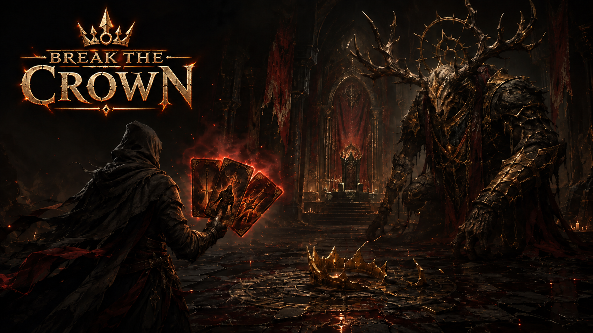
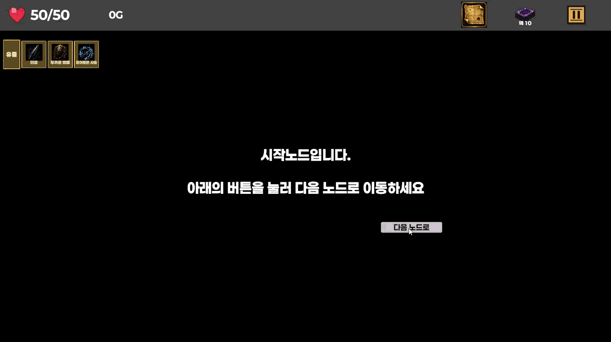
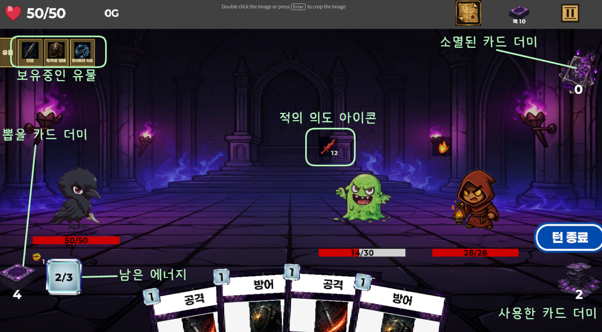

# Break the Crown

<p align="center">
  
</p>

> **"카드와 유물의 시너지를 완성하여, 왕좌를 지키는 보스를 격파하라!"**  
> *Break the Crown*은 매 런마다 변화하는 경로를 탐험하며 덱을 강화하고 최적의 전략으로 적을 공략하는 **덱빌딩 로그라이크(Deck-building Roguelike)** 게임입니다.

| 프로젝트 정보 | 내용 |
| :--- | :--- |
| **개발 기간** | 2026.05.15 ~ 2026.06.25 (1인 개발) |
| **타깃 플랫폼** | Windows PC |
| **엔진 / 개발 환경** | Unity 6 (6000.3.15f1) / Universal Render Pipeline (URP) |
| **장르** | 덱빌딩 로그라이크, 턴제 전략 |

---

## 1. 🕹️ 게임 개요

플레이어는 시작 덱과 기본 유물을 지급받고 여정을 시작합니다.  
갈림길로 이어진 맵을 나아가며 **일반 전투, 엘리트 몬스터, 미지의 이벤트, 상점, 휴식처**를 마주하게 됩니다.

매 전투마다 손패와 한정된 에너지를 전략적으로 운용하고, **적의 다음 행동(Intent)을 미리 예측**하여 공격과 방어를 계산해야 합니다. 전투 승리 보상으로 주어지는 카드와 유물을 획득해 자신만의 시너지 덱을 구축하고, 최종 층의 보스를 쓰러뜨리는 것이 게임의 궁극적인 목표입니다.

---

## 2. 🧭 게임 진행 가이드 (Game Loop)

전체 게임은 다음과 같은 루프로 순환하며 진행됩니다:

```text
[시작 로드아웃 선택] 
       ↓
 [맵 경로 탐색]  ───────→  [이벤트 / 상점 / 휴식]
       ↓                         ↓
  [카드 전투]   ←────────────────┘
       ↓
[승리 보상 & 덱빌딩] (카드 선택, 골드/유물 획득)
       ↓
  [보스 전투]   ───────→  [엔딩 & 메타 성장 (영구 강화)]
```

---

### 2.1 런의 시작 (Loadout)
* 게임을 시작하면 기본 공격 및 방어 카드, 그리고 캐릭터 고유의 시작 유물을 지급받고 첫 번째 구역의 진입로에 서게 됩니다.

---

### 2.2 맵 탐험과 경로 선택 (Map Exploration)

플레이어는 매 층마다 절차적으로 생성된 분기 노드 중 원하는 경로를 직접 선택해 나아갑니다.

<p align="center">
  
  
</p>

#### 🗺️ 주요 노드 종류
* ⚔️ **일반 전투 (Battle)**: 기본 몬스터와 조우합니다. 승리 시 골드와 카드 보상을 얻습니다.
* 💀 **엘리트 전투 (Elite)**: 강력한 적이 등장하지만, 승리 시 높은 확률로 유물과 많은 골드를 획득합니다.
* ❓ **미지의 이벤트 (Event)**: 다양한 선택지가 주어지며, 위험을 감수하고 큰 이득을 얻거나 불이익을 받을 수 있습니다.
* 💰 **상점 (Shop)**: 전투로 모은 골드로 강력한 유물을 구매하거나, 덱의 불필요한 카드를 제거(정제)합니다.
* 🏕️ **휴식처 (Rest)**: 소모된 체력을 회복하여 다음 고난을 대비합니다.
* 👑 **보스 (Boss)**: 구역의 최종 관문입니다. 보스를 격파하면 런 승리와 함께 엔딩에 도달합니다.

---

### 2.3 전투 시스템 (Combat System)

전투는 턴 방식으로 진행되며, 플레이어의 턴과 적의 턴이 번갈아 실행됩니다.

<p align="center">
  
</p>

#### 1) 턴 흐름
1. **턴 시작**: 최대 에너지가 충전되고, 드로우 더미(뽑을 카드 더미)에서 카드를 손패로 뽑습니다.
2. **플레이어 턴**: 카드의 코스트(비용)를 소모하여 원하는 순서대로 카드를 사용합니다.
3. **턴 종료**: 사용하지 않고 남은 손패는 버림 더미로 이동하며, 적의 행동 단계로 전환됩니다.
4. **적 턴**: 적이 사전에 예고된 의도(Intent)대로 행동을 실행합니다.

#### 2) 적 의도(Intent) 읽기
* 적 머리 위에는 **다음 턴에 어떤 행동을 할지(공격 피해량, 방어도 획득, 버프, 디버프 등)** 가 아이콘과 수치로 상시 표시됩니다.
* 적의 공격력이 높다면 방어 카드로 방어도를 충분히 쌓고, 적이 수비/강화에 집중할 때는 공격을 몰아치는 수 싸움이 핵심입니다.

#### 3) 카드 조작 및 사용법
* 손패의 카드를 마우스로 클릭하고 적 방향으로 드래그하면 베지어 곡선 타겟팅 라인이 형성되며, 대상 위에서 마우스를 놓으면 발동합니다.

<p align="center">
  
</p>

#### 4) 상태이상 (Status Effect) 시너지
전투에는 다양한 상태 효과가 존재하며, 이를 조합해 폭발적인 시너지를 낼 수 있습니다:

| 상태이상 | 효과 설명 |
| :--- | :--- |
| 🔥 **화상 (Burn)** | 턴 종료 시 중첩 수만큼 고정 피해를 입고, 중첩이 점차 감소합니다. |
| 🛡️ **취약 (Vulnerable)** | 대상이 받는 공격 피해량이 증폭되어 치명적인 데미지를 가합니다. |
| ⚔️ **약화 (Weakness)** | 대상이 가하는 공격 피해량이 감소하여 아군 피해를 최소화합니다. |
| ⚡ **과부하 (Overload)** | 특정 조건에서 추가 효과를 발동시키거나 증폭시키는 전용 버프/디버프입니다. |
| 🔔 **이명 (Ringing)** | 대상의 행동과 스킬 효율을 저하시키는 특수 상태이상입니다. |

---

### 2.4 보상과 덱 빌딩 (Reward & Deck Building)

전투에서 승리하면 무작위 카드 3장 중 1장을 선택해 덱에 추가하거나, 원치 않을 경우 건너뛸(Skip) 수 있습니다.
* **덱 압축의 미학**: 무조건 카드를 많이 넣는 것이 좋은 것이 아니며, 핵심 시너지 카드 위주로 덱 회전률을 높이는 것이 공략의 지름길입니다.
* **유물(Relic) 획득**: 전투 승리나 보물상자에서 얻는 유물은 런이 끝날 때까지 지속되는 영구 패시브 효과를 제공하여 전투 양상을 근본적으로 바꿉니다.

---

### 2.5 상점과 휴식 (Shop & Rest)

* 💰 **상점 (Shop)**: 전투로 획득한 골드를 지불하여 진열된 강력한 유물을 사거나, 시작 기본 카드 등 덱의 잉여 카드를 제거할 수 있습니다.
* 🏕️ **휴식처 (Rest)**: 감소한 체력을 회복하여 다음 고난(엘리트/보스)에 대비할 수 있는 소중한 정비 구간입니다.

---

### 2.6 보스전, 엔딩 그리고 메타 성장 (Meta Progression)

<p align="center">
  
  
</p>

* **보스전 & 엔딩**: 모든 층을 뚫고 최종 보스를 처치하면 런 승리와 함께 엔딩을 보게 됩니다.
* **메타 성장 (유물 상점)**: 런이 종료되면(승리 또는 패배) 플레이 결과에 따라 골드가 정산됩니다. 로비의 **유물 상점**에서 영구적인 유물을 해금하면 다음 런의 시작 로드아웃에서 선택할 수 있어 런을 거듭할수록 더욱 다양한 전략을 구사할 수 있습니다.

---

## 3. 🎮 조작 방법 및 편의 UX

### 조작 가이드

| 입력 | 기능 |
| :--- | :--- |
| **마우스 좌클릭 & 드래그** | 카드를 선택하고 적/자신에게 조준하여 사용 |
| **턴 종료 버튼 클릭** | 플레이어 턴을 마치고 적 턴으로 전환 |
| **마우스 오버 (Hover)** | 카드, 유물, 적 의도, 상태이상 아이콘의 상세 설명 및 툴팁 확인 |
| **`ESC` / 일시정지 아이콘** | 환경설정 및 일시정지 메뉴 호출 |

### 키워드 자동 감지 툴팁 시스템
카드나 유물 설명에 등장하는 전문 용어(예: *화상*, *취약*, *에너지*, *소멸* 등) 위에 마우스를 올리면 관련 규칙을 설명하는 툴팁이 즉각 팝업됩니다. 툴팁 설명 안에 포함된 또 다른 키워드까지 추적하여 초보자도 게임 내 모든 룰을 직관적으로 이해할 수 있습니다.

<p align="center">
  
</p>

---

## 4. 🏗️ 핵심 시스템 및 기술적 설계 강점

*Break the Crown*은 단순한 룰 구현에 그치지 않고, **장기적인 콘텐츠 확장과 유지보수성**을 고려하여 탄탄한 소프트웨어 아키텍처 위에서 개발되었습니다.

### 4.1 조합형 CardAction 아키텍처 (Data-Driven Design)
카드를 개별 C# 스크립트로 하드코딩하지 않고, `DealDamage`, `GainArmor`, `ApplyBurn`, `DrawCard` 등 원자적 단위의 `CardAction`을 `ScriptableObject`로 구현했습니다.
* **코드 수정 없는 콘텐츠 확장**: 신규 카드를 추가할 때 프로그래머의 코드 작업 없이 기획자가 유니티 에디터 상에서 여러 Action을 직렬화 조합하여 즉시 새로운 복합 효과 카드를 생산할 수 있습니다.
* **설명 텍스트 자동 조립**: 카드의 설명문 또한 각 Action이 제공하는 텍스트 블록을 자동으로 병합하여 데이터 불일치 버그를 원천 차단합니다.

<p align="center">
  
</p>

---

### 4.2 비침투적 Relic Hook 시스템 (OCP 준수)
유물 효과가 카드 발동 코드나 체력 계산 로직에 직접 개입하지 않도록 이벤트 훅(Hook) 구조로 분리했습니다.
* **Hook 주기**: `전투 시작`, `카드 사용 전/후`, `데미지 계산 시`, `피격 시`, `사망 직전` 등의 라이프사이클을 제공합니다.
* **낮은 결합도**: 각 유물은 자신에게 필요한 Hook만 선택적으로 오버라이드하여 동작하며, 카드나 적 캐릭터 코드는 유물의 존재를 전혀 알 필요가 없습니다(개방-폐쇄 원칙 준수).

<p align="center">
  
</p>

---

### 4.3 절차적 맵 생성 (Procedural Graph Generation)
* `MapGenerator`를 통해 층별 노드 가중치에 따라 그래프를 동적으로 생성하며, 모든 경로가 보스 노드로 도달 가능하도록 유효성 검증을 수행합니다.
* 노드와 노드 사이의 연결선은 `Bezier.cs` 스플라인 곡선 알고리즘을 사용해 자연스럽고 유려한 비주얼 맵을 렌더링합니다.

---

### 4.4 Firebase & UniTask 기반 비동기 데이터 파이프라인
* **계정 및 저장소 연동**: Firebase Authentication(익명 및 이메일 연동) 및 Realtime Database를 도입하여 플레이어의 런 스냅샷, 결과 통계, 메타 상점 성장 데이터를 안전하게 클라우드에 동기화합니다.
* **무중단 비동기 처리**: 코루틴 대신 `UniTask`를 전면 적용하여 가비지 컬렉션(GC) 할당을 최소화하고 비동기 네트워크 통신 중에도 프레임 드랍 없는 부드러운 화면 전환을 유지합니다.

---

## 5. 🛠️ 기술 스택

| 분류 | 기술 | 활용 목적 |
| :--- | :--- | :--- |
| **Engine & Language** | Unity 6 (6000.3.15f1) / C# | 핵심 클라이언트 시스템 및 URP 그래픽 렌더링 |
| **Architecture** | ScriptableObject 기반 Data-Driven | 카드 액션 및 유물 데이터 조합식 설계 |
| **Backend & Cloud** | Firebase Auth & Realtime Database | 유저 인증, 런 결과 정산, 메타 진행 클라우드 저장 |
| **Async Framework** | UniTask | 제로 알로케이션 비동기 작업 및 네트워크 통신 |
| **UI & UX** | TextMeshPro, Bezier System | 동적 키워드 툴팁, 부채꼴 카드 핸드 연출, 곡선 타겟팅 라인 |

---

## 6. 🚀 실행 방법

### 1) PC 빌드 실행
* `Builds/Release0.3.0/BreakTheCrown.exe` 파일을 더블 클릭하여 바로 실행할 수 있습니다.

### 2) Unity 에디터에서 실행
1. **Unity Hub**를 실행하고 **Unity 6 (버전 `6000.3.15f1`)**을 설치합니다.
2. 해당 프로젝트 폴더를 열고 로딩이 완료될 때까지 대기합니다.
3. `Assets/Scenes/MainScene.unity` 씬을 열고 상단 **Play(▶)** 버튼을 클릭합니다.

---

## 7. 📌 추가 정보 및 링크

* 📖 **프로젝트 상세 기획 및 개발 문서**: [Notion 상세 문서 바로가기](https://app.notion.com/p/3d4dd6c432c181659c5adb121a06c593?pvs=204)
* 📋 **프로젝트 관리**: GitHub Projects 보드를 통해 이슈 단위 주차별 스프린트 및 빌드 마일스톤 운영
