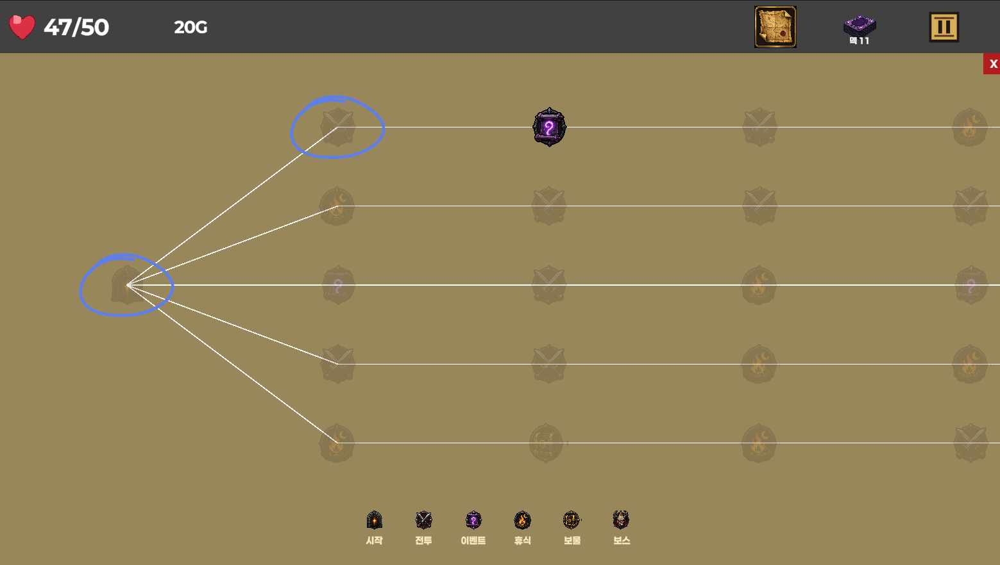
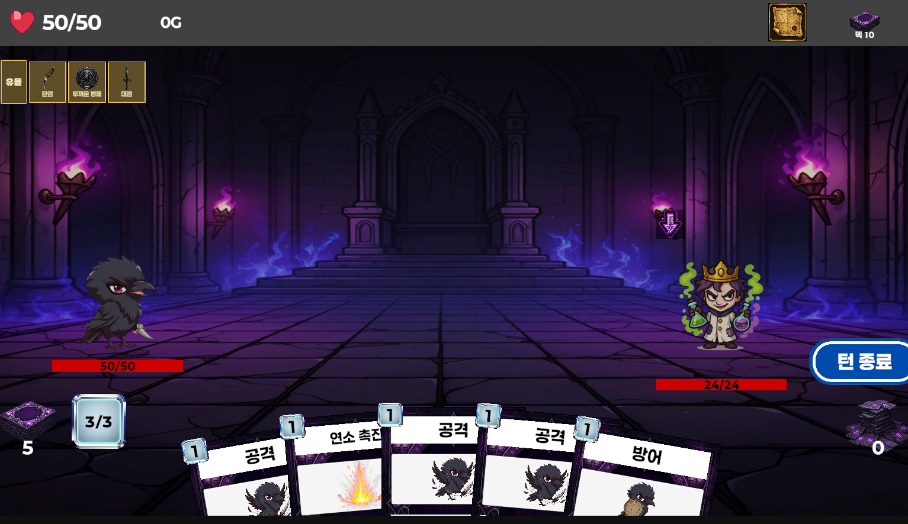
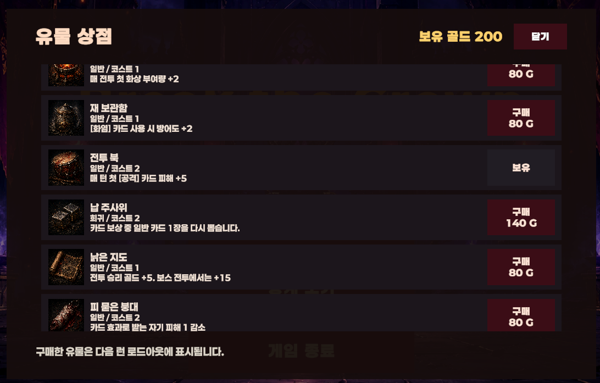
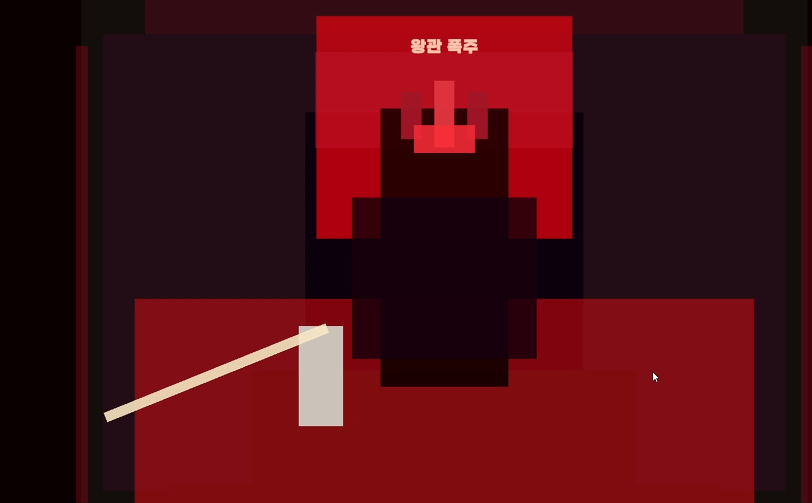
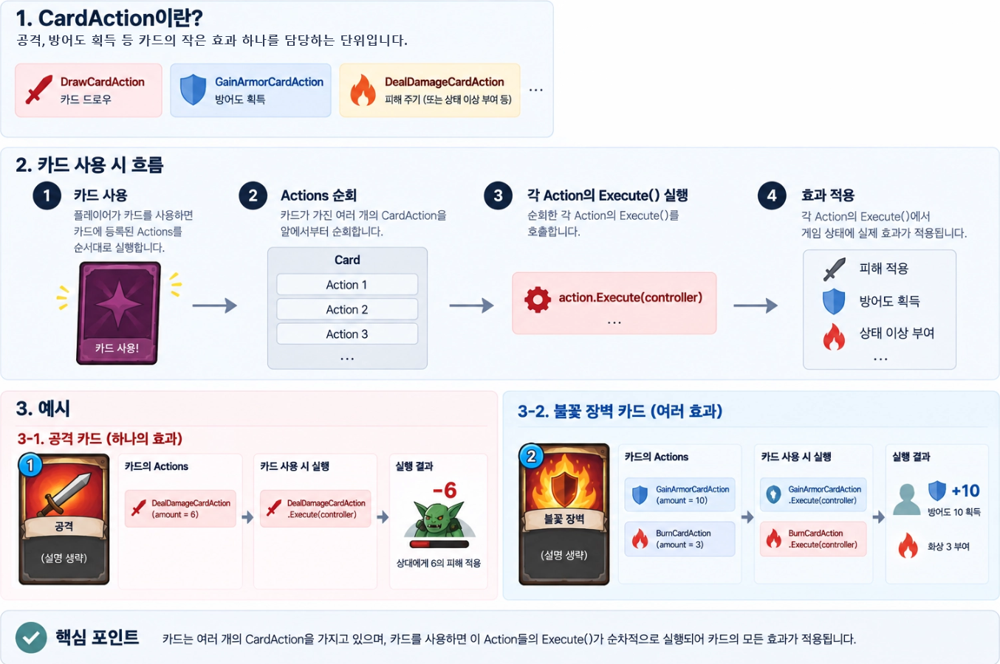
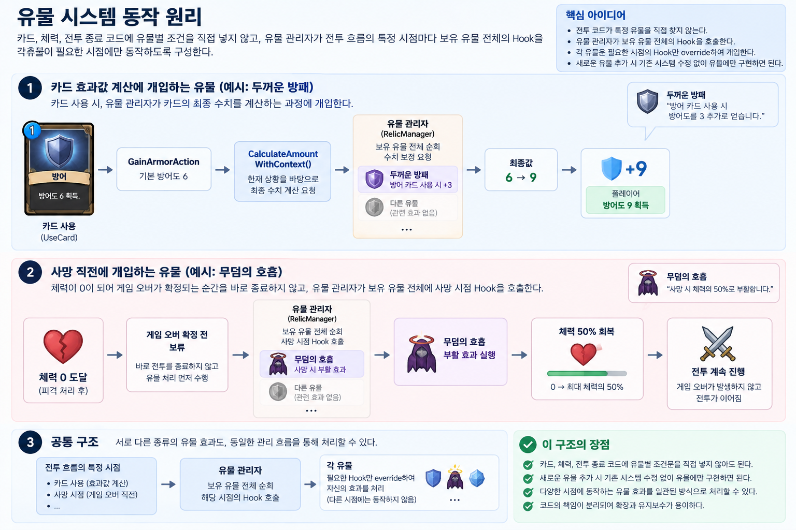
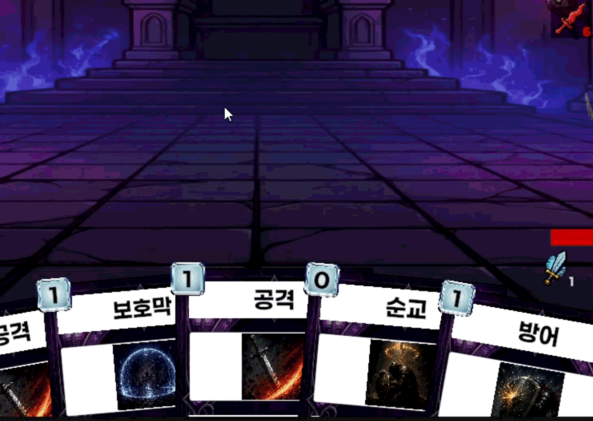

# Break the Crown

> 카드와 유물을 조합해 덱을 강화하고 보스를 공략하는 덱빌딩 로그라이크 게임입니다.

| 프로젝트 정보 | 내용 |
| --- | --- |
| 개발 기간 | 2026.05.15 ~ 2026.06.25 |
| 개발 인원 | 1인 |
| 플랫폼 | Windows PC |
| 엔진 | Unity 6.3.15f1 |

## 게임 소개

플레이어는 시작 카드와 유물을 선택한 뒤, 맵의 노드를 따라 전투·휴식·이벤트·보물상자를 진행합니다. 손패와 에너지, 적의 의도를 읽고 카드를 사용해 전투를 풀어가며, 승리 보상으로 카드·골드·유물을 얻어 덱의 전략을 확장합니다. 마지막 보스를 처치하면 한 번의 런이 완료됩니다.

## 플레이 흐름

```text
시작 카드·유물 선택 → 맵 노드 선택 → 카드 전투 → 카드·골드·유물 보상 → 덱 강화 → 보스 전투 → 엔딩
```

| 맵 진행 | 전투와 보상 |
| --- | --- |
|  |  |
| 다음 노드를 선택해 전투와 상점, 보스전으로 이어지는 경로를 결정합니다. | 카드를 적에게 사용하고, 승리한 전투에서 다음 덱 구성을 위한 보상을 얻습니다. |

| 유물 상점 | 런의 마무리 |
| --- | --- |
|  |  |
| 전투로 획득한 골드로 유물을 구매해 이후 전투 규칙을 바꿉니다. | 보스 처치 후 엔딩으로 이어지며, 런 결과와 메타 진행을 저장합니다. |

## 핵심 시스템

### CardAction 조합 구조

카드를 하나의 고정된 기능으로 만들지 않고, 피해·방어도 획득·드로우·상태 효과처럼 작은 `CardAction`을 조합해 구성했습니다. 카드 사용 시에는 Action을 순서대로 실행하고, 카드 설명도 같은 Action이 제공하는 문구를 조합해 표시합니다.

즉, 여러 효과를 가진 카드는 여러 Action을 보유하는 데이터가 됩니다. 새 카드를 추가할 때 기존 전투 코드를 수정하기보다 필요한 Action을 카드 에셋에 조합하는 방식으로 콘텐츠를 확장할 수 있습니다.

<p align="center">
  
</p>

### Relic Hook 기반 확장

유물 효과를 카드나 체력 코드의 조건문으로 직접 추가하지 않고, 전투 시작·카드 사용 전후·피격·사망 직전 같은 Hook 시점과 효과값 계산 단계로 분리했습니다. 유물 관리자가 해당 시점마다 보유 유물 전체의 Hook을 호출하고, 각 유물은 필요한 Hook만 구현합니다.

예를 들어 카드 효과에 영향을 주는 유물은 카드의 기본 효과를 바꾸지 않고 최종 적용값 계산에 개입합니다. 사망 직전에 동작하는 유물은 전투 종료를 확정하기 전에 Hook을 통해 부활 같은 효과를 처리할 수 있습니다. 이 구조로 카드와 유물이 서로를 직접 알지 않아도 전투 규칙을 확장할 수 있습니다.

<p align="center">
  
</p>

### 키워드 툴팁

카드·유물·적 설명 문자열에서 등록된 키워드를 자동으로 찾아 강조하고, 마우스 호버 시 공통 설명 패널을 표시합니다. 카드 설명뿐 아니라 보상·덱·적 의도 UI에서도 같은 흐름을 재사용하며, 키워드 설명 안에 다시 등장하는 키워드도 추적해 중복된 설명은 제거합니다.

플레이어는 전투 화면을 벗어나지 않고 상태 효과와 카드 속성을 확인할 수 있어, 카드 텍스트는 짧게 유지하면서도 필요한 규칙에 접근할 수 있습니다.

<p align="center">
  
</p>

### 플레이 루프와 메타 진행

손패·에너지·덱·버림 더미·적 의도·턴 전환·승리·패배 처리를 연결해 카드 전투의 기본 루프를 구성했습니다. 전투 승리 후에는 카드·골드·유물 보상을 선택하고, 선택 결과가 덱과 메타 진행에 반영됩니다.

익명 로그인 및 이메일 계정 연동을 지원하며, 런 결과와 메타 진행 데이터를 사용자 단위로 저장·조회합니다. Firebase 작업은 UniTask 기반 비동기로 처리했습니다.

## 기술 스택

| 기술 | 활용 |
| --- | --- |
| Unity 6 / C# | 전투, UI, 게임 데이터 시스템 구현 |
| ScriptableObject | 카드와 `CardAction` 데이터 구성 |
| Firebase Authentication | 익명 로그인 및 이메일 계정 연동 |
| Firebase Realtime Database | 런 기록과 메타 진행 저장·조회 |
| UniTask | Firebase 비동기 처리 |

## 실행 방법

### Windows 빌드 실행

`Builds/Release0.3.0/BreakTheCrown.exe`를 실행합니다.

### Unity에서 실행

1. Unity Hub에서 Unity `6000.3.15f1`을 설치합니다.
2. 이 저장소를 Unity 프로젝트로 엽니다.
3. `Assets/Scenes/MainScene.unity`를 열고 Play 버튼을 누릅니다.

## 조작 방법

| 동작 | 조작 |
| --- | --- |
| 메뉴 선택 | 마우스 클릭 |
| 카드 사용 | 카드를 적 위로 드래그 앤 드롭 |
| 턴 종료 | 화면 우측의 턴 종료 버튼 클릭 |
| 카드·유물·상태이상 설명 | 대상에 마우스 호버 |
| 일시정지 | `ESC` 또는 HUD 일시정지 버튼 |

## 참고

- 프로젝트 상세 문서: [Break the Crown 수정본](https://app.notion.com/p/3d4dd6c432c181659c5adb121a06c593?pvs=204)
- GitHub Project 보드에서 이슈 단위로 작업을 나누고, 주차별 플레이 가능한 빌드를 목표로 진행했습니다.
